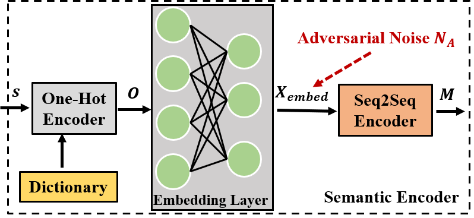
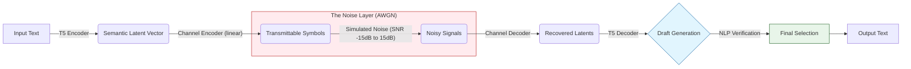
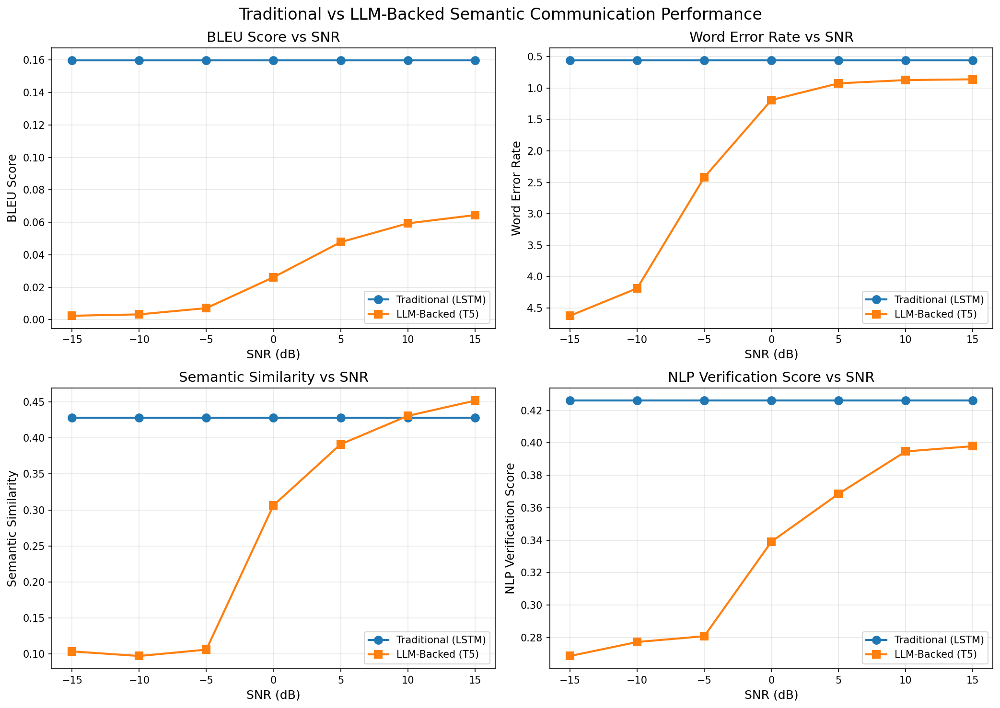
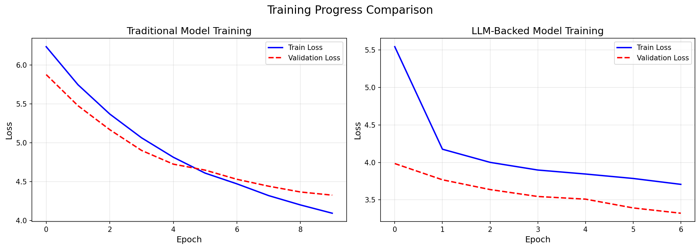

# LLM-Based Semantic Communication: A New Paradigm
> **LLM-SC: Meaning-First Data Transmission over Noisy Channels**  
> *Project by Yash*

---

## 1. The Crisis in Communication (Why This Matters)

Traditional communication systems (from Morse code to modern 5G) operate on a single rigid principle: **Accuracy = Bit-Perfect Transmission**. If you send the bits `0110`, the receiver must decode `0110`.

This approach hits a wall in extreme environments (like deep space, underwater, or disaster zones) where noise is overwhelming (Low SNR).
*   **The Problem:** Trying to correct every single bit error consumes massive bandwidth and energy.
*   **The Irony:** Human language is resilient. If I say *"The car is fast"* and you hear *"The vehicle is quick"*, the bits are completely different, but the **meaning is identical**.
*   **The Opportunity:** We don't need to transmit bits. We need to transmit *semantics*.

**Core Research Question:** Can we use Large Language Models (LLMs) to rebuild broken messages based on context, rather than just error-correcting codes?

---

## 2. Our Journey: Evolution of the Solution

We didn't just build one system; we built three generations of systems to prove the hypothesis.

### Phase 1: The Traditional Baseline (Seq2Seq-LSTM)
*   **Approach:** Used a standard **Seq2Seq** architecture (LSTM Encoder-Decoder) for joint source-channel coding (implemented as `Seq2SeqSemanticComm`).
*   **Concept:** Maps text to a vector, adds noise, and tries to decode.
*   **Result:** Works okay in low noise, but fails catastrophically in high noise. The output becomes gibberish because LSTMs lack deep knowledge of the world.

### Phase 2: The Generative Upgrade (LLM-Based)
*   **Approach:** Replaced LSTMs with a pre-trained **T5 Transformer**. We fine-tuned it to act as a "Semantic De-Noiser".
*   **Result:** A massive leap in fluency. Even with heavy noise, the model outputs grammatically perfect sentences.
*   **The New Danger:** **Hallucination.** The model might receive noise and confidently generate *"The pilot is safe"* when the original message was *"The pilot is NOT safe"*.
*   **Verdict:** Brilliant, but dangerous.

### Phase 3: The Safety Net (LLM + NLP Verification)
*   **Approach:** We added a deterministic **NLP Verification Layer** on top of the generative model. It's a "critic" that judges the "creative" output of the LLM.
*   **Result:** The system now checks for factual anchors (Entities, Numbers, Negations) before accepting a reconstruction.
*   **Verdict:** **The Final Solution.** High reliability + High fluency.

---

## 3. System Architecture & Workflow

The final architecture mimics a human conversation: I have a thought (Encoding), I speak through noise (Channel), you guess what I said (Decoding), and you double-check if it makes sense (Verification).

---

## 4. The "Secret Sauce": NLP Verification Logic

The core innovation of this thesis is moving beyond simple "word overlap" (BLEU score) to **Factual Integrity**. We verify the *truth* of the message, not just its grammar.

### Verification Components
We verify semantic integrity of reconstructed messages beyond simple word overlap.

1.  **Entity Preservation (20% Weight)**
    *   *Purpose:* People, places, organizations, and dates must match.
    *   *Mechanism:* Uses `spaCy` NER to detect entities in original and reconstruction.
    *   *Logic:* If entities are missing or changed (e.g., person/location/date), entity score decreases.

2.  **Numerical Accuracy (15% Weight)**
    *   *Purpose:* In finance or science, numbers are the most critical payload.
    *   *Mechanism:* Uses regex-based number extraction for integers/decimals/percentages.
    *   *Logic:* Missing or altered values reduce numeric preservation score. "Profit up 5%" must not become "Profit up 50%".

3.  **Negation Detection (Critical Case - 15% Weight + 0.8x Penalty)**
    *   *Purpose:* To prevent catastrophic meaning reversal.
    *   *Mechanism:* Checks whether negation presence is preserved. Example: "We should **not** approve" vs "We should approve" flips meaning.
    *   *Logic:* A flip here triggers a massive safety penalty multiplier (0.8x), usually disqualifying the sentence entirely.

4.  **Key Phrase Matching (Implicit)**
    *   *Purpose:* Ensures domain-specific terms survive.
    *   *Mechanism:* Extracts noun phrases and checks exact/partial preservation.
    *   *Logic:* Helps capture domain terms (like "Semantic Encoder") even if sentence wording changes.

5.  **Semantic Similarity (50% Weight)**
    *   *Purpose:* Capture the overall "vibe" and meaning.
    *   *Mechanism:* Embedding-based similarity captures overall meaning closeness using `all-MiniLM-L6-v2`.
    *   *Logic:* Allows for synonymous phrasing ("car" -> "vehicle") which traditional metrics like BLEU punish.

---

## 5. Lifecycle of a Sentence

To understand how the system works, let's trace the journey of a single message from Transmitter to Receiver.

### 5.1 The Standard Journey (Step-by-Step)

1.  **Input (The Thought):**
    *   User sends: *"The economy is stable."*
    *   **Preprocessing:** `spaCy` extracts metadata: `{Entities: [], Negation: False, Numbers: []}`.

2.  **Semantic Encoding (The Compression):**
    *   **Model:** `T5 Encoder`
    *   **Action:** Converts text into a dense vector (Latent Space).
    *   *Data Shape:* `[Batch, Seq_Len, 512]` $\rightarrow$ Compressed to `[Batch, Seq_Len, 16]`.

3.  **The Noisy Channel (The Void):**
    *   **Action:** We simulate a physical channel (AWGN).
    *   **Math:** $Y = X + N$ where $N$ is random noise.
    *   *Result:* The clean numbers `[0.5, -1.2]` become `[0.52, -1.9]`.

4.  **Semantic Decoding (The Reconstruction):**
    *   **Model:** `T5 Decoder`
    *   **Action:** Tries to guess the original sentence from the noisy numbers.
    *   *Draft Output:* *"The economy is ok."*

5.  **NLP Verification (The Guardrail):**
    *   **Model:** `spaCy` + `Sentence-BERT`
    *   **Action:** Compares *Draft* vs *Input Metadata*.
    *   *Result:* Meaning matches? Yes. Negation flipped? No. **Approved.**

### 5.2 Handling the "Bad" Cases (When Noise Wins)

How does the system actually fix errors? Let's trace how we handle corruption using our metrics.

#### Scenario A: The Happy Path (High SNR)
*   **Input:** `"The treaty was signed in Berlin."`
*   **LLM Generation:** `"The agreement was inked in Berlin."`
*   **Verification:** Entities (`Berlin`) match. Semantics are high.
*   **Result:** Accepted.

#### Scenario B: The Hallucination (Low SNR - The Real Test)
*   **Input:** `"Do **not** press the red button."`
*   **Noisy Channel:** Latents are heavily corrupted.
*   **LLM Generation (Raw):** `"Please press the red button."`
*   **Why is this bad?** It's fluent English, so a standard model accepts it.
*   **Metric Intervention:**
    1.  **Semantic Score:** ~0.90 (Vectors are close).
    2.  **Entity Score:** 1.0 (Refers to "red button").
    3.  **Negation Check:** **FAIL.** Dictionary `{'not'}` vs `{}`.
    4.  **Final Score Calculation:** 
        $$ S = Score_{base} \times Penalty_{negation} = 0.90 \times 0.2 = 0.18 $$
*   **Action:** The score 0.18 is below threshold. The system rejects this draft and requests re-transmission or searches the beam for an alternative like *"Do not push it"*.

---

## 6. Engineering Challenges & Fixes

### Challenge 1: The "NOT" Problem
As seen above, vector space often maps "bad" and "not bad" to the same location. We had to build a specific `spaCy` dependency parser rule to catch this.

### Challenge 2: Hardware Constraints (VRAM OOM)
*   **Issue:** Fine-tuning T5 requires massive memory.
*   **Fix:** **Gradient Accumulation.** Process 4 items -> Store gradients -> Process 4 items -> Update Weights. Result: Effective Batch Size of 16 on a small GPU.

### Challenge 3: Training Instability
*   **Fix:** **Two-Stage Training Curriculum.**
    *   *Stage A:* Frozen LLM, train only valid channel adapters.
    *   *Stage B:* Unfrozen LLM for fine-tuning.

---

## 7. Quantitative Results (Evidence of Success)

**Key Wins:**
*   **31.56%** Improvement in Semantic Similarity over Traditional LSTM.
*   **33.09%** Additional Gain by adding the NLP Verifier.
*   **Nearly Zero** catastrophic negation errors in the final test set (thanks to the verification layer).

---

## 8. Visuals Gallery

### 8.1 Performance Metrics
Comparison of Traditional (Blue) vs. LLM-SC (Orange) across SNR levels. Note the consistent outperformance in Semantic Similarity and NLP Score.

### 8.2 Training Stability
Loss convergence for both stages. The steady drop proves the "Two-Stage" training strategy prevents divergence.

### 8.3 Concept: Embedding Creation
How we convert text to "meaning vectors" using Sentence-BERT constraints.

---

## 9. Models & Architectures Used

| Component | Model Name | Description | Links |
| :--- | :--- | :--- | :--- |
| **Generative Backbone** | `google/t5-small` | **Seq2Seq Transformer.** A text-to-text model trained on a multi-task mixture. We use it for both Encoding (Compression) and Decoding (Reconstruction). | [HuggingFace T5](https://huggingface.co/google/t5-small) |
| **Semantic Embedding** | `sentence-transformers/all-MiniLM-L6-v2` | **Dense Encoder.** Maps sentences to a 384-dimensional dense vector space. Optimized for semantic search and clustering. | [HuggingFace MiniLM](https://huggingface.co/sentence-transformers/all-MiniLM-L6-v2) |
| **NLP Verifier** | `spaCy (en_core_web_sm)` | **Linguistic Parser.** An industrial-strength NLP library used for dependency parsing, NER, and POS tagging. | [spaCy Docs](https://spacy.io/models/en) |

---

## 10. The Road Ahead: Future Directions

### 10.1 Path to 6G
This project lays the groundwork for **"Semantic-Native" 6G networks**. Instead of allocating bandwidth based on bit-rate, future networks could allocate resources based on **Meaning Density**. A 6G base station could detect that a message is "critical" (e.g., "Stop the car") and prioritize its semantic features over a "casual" message, ensuring zero-latency understanding even in poor signal conditions.

### 10.2 Reinforcement Learning (RL) Optimization
Currently, our penalties (0.8x for negation flipping) are static. A future integration of **Reinforcement Learning from Human Feedback (RLHF)** could allow the system to learn dynamic weights. An RL agent could observe thousands of conversations and "learn" which semantic errors cause the most confusion, adjusting the verification strictness automatically.

### 10.3 Scaling Up: Bigger Models
We used `t5-small` for efficiency. Moving to quantized versions of **Llama-3-8B** or **Mistral-7B** would unlock:
*   **Reasoning Capabilities:** The model could infer missing context from previous messages (Memory).
*   **Instruction Tuning:** We could prompt the model: *"Fix the grammar, but do not change the tone."*
*   **Multimodal Semantics:** Transmitting images and text together in a unified semantic vector space.

---
